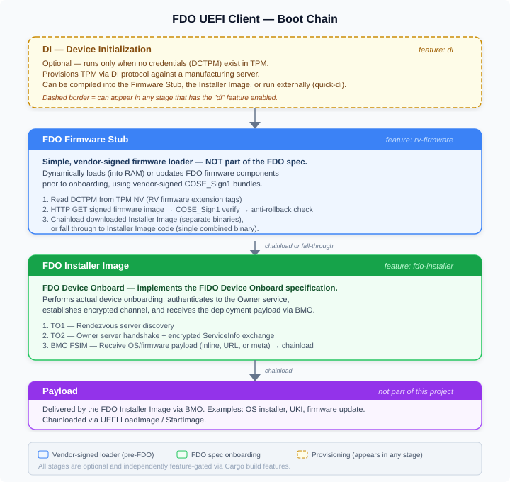

<!-- Copyright 2026 Dell Technologies, All Rights Reserved -->
<!-- Author: Brad Goodman <bradley.goodman@dell.com> -->
<!-- SPDX-License-Identifier: Apache-2.0 -->

# FDO UEFI Client (Rust)

A UEFI application for FIDO Device Onboard (FDO), written in Rust.

## How It Works

The centerline use case is a **single binary that does everything**:

1. **If the device has no credentials** — run Device Initialization (DI)
   to provision the TPM against a manufacturing server.
2. **If a firmware update is available** (optional, `rv-firmware` feature) —
   download and verify a vendor-signed image, then re-execute with the
   updated code.
3. **Otherwise** — run the FDO onboarding protocol (TO1/TO2) to
   authenticate to the Owner service, receive the OS/firmware payload
   via BMO, and chainload it.

The default build (`cargo build`) produces one EFI binary (~150–175 KB)
that handles steps 1 and 3. Add `--features rv-firmware` to include
step 2 as well. In practice, the full binary is small enough that
splitting it into separate components may never be necessary.

### Why the modular split exists

The architecture *allows* each capability to be compiled independently
(via Cargo features `di`, `fdo-installer`, `rv-firmware`) for cases
where size or deployment constraints matter — for example, a
flash-resident firmware stub that only does step 2 and chainloads a
separately-delivered installer image for step 3. But for most
deployments a single binary with all features enabled is all you need.

## Boot Chain Detail

The diagram below shows all three stages and how they compose. Each
stage is optional and independently feature-gated:



**Key points:**

- **FDO Firmware Stub ≠ FDO spec.** The Firmware Stub (`rv-firmware`) is a
  simple, vendor-signed loader that dynamically loads or updates FDO
  firmware components into RAM *prior to onboarding*. It uses COSE_Sign1
  bundles signed by the platform vendor — it is not part of the FIDO
  Device Onboard specification.
- **FDO Installer Image = FDO spec onboarding.** The Installer Image
  (`fdo-installer`) implements the actual FIDO Device Onboard protocol
  (TO1/TO2) to authenticate to the Owner service, establish an encrypted
  channel, and receive the deployment payload via BMO.
- **DI is always optional.** It only runs when no DCTPM credentials exist
  in the TPM. Once credentials are provisioned, DI is skipped on all
  subsequent boots.
- **DI can run in multiple places.** If the FDO Firmware Stub includes DI
  (`rv-firmware` + `di`), the device self-provisions at the factory without
  needing a server to serve the FDO Installer Image. If the Installer
  Image is run directly (without the Stub), it handles DI on its own.
  DI can also be performed externally via `quick-di` or
  `go-fdo-manufacturing-station`.
- **The FDO Firmware Stub is optional.** If you don't need signed firmware
  delivery / chainloading, build and run the FDO Installer Image directly.

## Building

All builds use Rust nightly with the UEFI target. The common build flags are:

```bash
CARGO_FLAGS="-Zbuild-std=core,alloc -Zbuild-std-features=compiler-builtins-mem --target x86_64-unknown-uefi"
```

### Build Features

Three independent features control which capabilities are compiled in:

| Feature | What it includes | Default? |
|---------|-----------------|----------|
| `di` | Device Initialization — FDO DI protocol (manufacturing/provisioning) | Yes |
| `fdo-installer` | FDO Installer Image — TO1/TO2 onboarding + BMO payload delivery | Yes |
| `rv-firmware` | FDO Firmware Stub — RV-based firmware delivery (COSE_Sign1 verify + chainload) | No |

Transport features (both default-on):

| Feature | Description |
|---------|-------------|
| `uefi-http` | HTTP via `EFI_HTTP_PROTOCOL` (works in OVMF/QEMU) |
| `tcp4-http` | HTTP via raw TCP4 (works on real hardware without HttpDxe) |

### Build Examples

Pick the features you need. Use `--no-default-features` to start from
scratch, then add back only what you want:

```bash
# Full build (default) — DI + FDO Installer Image
# This is what most people want: provisions if needed, then onboards.
cargo +nightly build --release $CARGO_FLAGS

# FDO Installer Image only (no DI) — device was provisioned externally
cargo +nightly build --release --no-default-features \
  --features uefi-http,tcp4-http,fdo-installer $CARGO_FLAGS

# DI only — just provision the TPM, nothing else
cargo +nightly build --release --no-default-features \
  --features uefi-http,tcp4-http,di $CARGO_FLAGS

# FDO Firmware Stub only — RV firmware delivery, no DI, no onboarding
# Assumes TPM was provisioned externally (e.g. quick-di).
cargo +nightly build --release --no-default-features \
  --features uefi-http,tcp4-http,rv-firmware $CARGO_FLAGS

# FDO Firmware Stub + DI — self-provisioning firmware stub
# Recommended OEM config: provisions at factory, then downloads +
# chainloads the FDO Installer Image.
cargo +nightly build --release --no-default-features \
  --features uefi-http,tcp4-http,rv-firmware,di $CARGO_FLAGS

# FDO Firmware Stub + DI + FDO Installer Image — everything
# Single binary that can provision, deliver firmware, AND onboard.
cargo +nightly build --release --no-default-features \
  --features uefi-http,tcp4-http,rv-firmware,di,fdo-installer $CARGO_FLAGS
```

### Valid Feature Combinations

Sizes are release builds for `x86_64-unknown-uefi`, measured 2026-09-01.
All include both HTTP transports (`uefi-http,tcp4-http`), which alone cost
51 KiB — that is the "base" the deltas below are measured against.

**These are shippable sizes: stripping changes nothing.** Rebuilding with
`-C strip=symbols` produces byte-identical output, because the toolchain writes
debug info to a separate `fdo_uefi.pdb` (128 KiB, MSVC convention) that never
ends up in the `.efi`. The image has no PE debug directory (RVA 0, size 0), and
`[profile.release]` already sets `lto = true`, `opt-level = "z"` and
`panic = "abort"`. There is no easy headroom left in these numbers.

| `di` | `fdo-installer` | `rv-firmware` | Size | over base | Use Case |
|:----:|:---------------:|:-------------:|--------:|----------:|----------|
| | | | 51 KiB | — | Transports only (not useful; baseline for comparison) |
| ✓ | | | 162 KiB | +111 KiB | Provision only (DI tool) |
| | | ✓ | 178 KiB | +127 KiB | Firmware stub only (pre-provisioned, chainloads Installer Image) |
| | ✓ | | 226 KiB | +175 KiB | Onboard only (pre-provisioned device) |
| ✓ | | ✓ | 238.5 KiB | +187.5 KiB | Self-provisioning firmware stub (OEM factory) |
| ✓ | ✓ | | 264 KiB | +213 KiB | **Default.** Provision + onboard + payload delivery |
| | ✓ | ✓ | 306 KiB | +255 KiB | Firmware update check → fall through → onboard (pre-provisioned) |
| ✓ | ✓ | ✓ | 340 KiB | +289 KiB | Single binary: firmware update check → fall through → DI + onboard |

Marginal cost of each feature added to the bare transports:

| Feature | Alone | Added to the other two |
|---------|---------:|-----------:|
| `di` | +111 KiB | +34 KiB |
| `fdo-installer` | +175 KiB | +101.5 KiB |
| `rv-firmware` | +127 KiB | +76 KiB |

The gap between the two columns is shared code — CBOR, COSE, TPM, and HTTP
helpers that each feature pulls in but only pays for once. `di` in particular
looks expensive alone (+111 KiB) yet adds only +34 KiB to a build that already
has the other two, because almost everything it needs is already linked.

Practical consequence for a flash-constrained Stage 1: the firmware stub is
178 KiB standalone, or 238.5 KiB if it must self-provision (`di` added). The
full single binary is 340 KiB — roughly double the minimal stub.

Where the space goes, for the 238.5 KiB `rv-firmware,di` build:

| Section | Size | Share |
|---------|---------:|------:|
| `.text` | 173 KiB | 73% |
| `.rdata` | 61 KiB | 26% |
| `.reloc` | 1.9 KiB | 1% |
| `.data` | 80 B | — |
| `.eh_frame` | 64 B | — |

Almost all of it is code and read-only data, so further reduction means removing
functionality (or the log strings in `.rdata`), not build-flag tuning.

See [docs/modular-architecture.md](docs/modular-architecture.md) for
deployment scenarios and how the stages compose in different environments.
See [docs/productization-guide.md](docs/productization-guide.md) for
flash layout, DI placement decisions, update mechanisms, and how the
test environment differs from production deployment.

### Prerequisites

**Build machine:**

```bash
rustup install nightly
rustup +nightly component add rust-src
```

**Test machine (pe2):**

```bash
sudo apt-get install qemu-system-x86 ovmf mtools dosfstools swtpm
# go-fdo server: build from ../go-fdo with `make build`
```

## Command-Line Options

Both the FDO Firmware Stub and FDO Installer Image accept arguments from
the EFI shell:

```text
Usage: fdo-uefi.efi [options]
  -di <url>          DI (manufacturing) server URL
  -rv <url>          RV/Owner server URL (TO1/TO2 override)
  -force-di          Run DI even if TPM already holds credentials
  -load-mode <m>     Chainload source: buffer|file (default buffer)
  -teardown          Disconnect NICs before StartImage (diagnostic)
  -v                 Verbose: per-round transport logging (off by default)
  -chainload <path>  Chainload a PE straight off the ESP and exit
  -watchdog [secs]   Arm watchdog for [secs] (default 30) and exit
  -h                 Show usage help
```

| Option | Purpose |
| ------ | ------- |
| `-di <url>` | Explicit DI (manufacturing) server. Overrides DNS discovery. |
| `-rv <url>` | Explicit RV/Owner server for TO1/TO2. Overrides the URL stored in the TPM credential. |
| `-force-di` | Ignore any existing TPM credential and re-provision from scratch. |
| `-load-mode <m>` | Pin the chainload `LoadImage` source. Applies to all chainload sites. |
| `-teardown` | Disconnect NICs before `StartImage`. Diagnostic; off by default. |
| `-v` / `-verbose` | Re-enable the per-round transport logging suppressed by default. |
| `-chainload <path>` | Diagnostic. Load a PE from the ESP and chainload it, then exit. |
| `-watchdog [secs]` | Diagnostic. Arm the watchdog and exit immediately. |

### Examples

```text
# DI against a specific manufacturing server
Shell> fdo-uefi.efi -di http://192.168.1.100:8080

# TO1/TO2 against a specific owner server (overrides credential)
Shell> fdo-uefi.efi -rv http://fdo-server.local:8080

# Both (DI server for first boot, RV for onboarding)
Shell> fdo-uefi.efi -di http://mfg-server:8080 -rv http://owner-server:8080

# Re-provision against a different server (see -force-di below)
Shell> fdo-uefi.efi -force-di -di http://newserver:8080 -rv http://newserver:8080
```

### `-force-di` — re-provisioning against a different server

Normally the client runs DI **only** when the TPM holds no credentials; if a
credential is present it goes straight to TO1/TO2. That is the correct
production behaviour, but it blocks a common test case: pointing an
already-provisioned device at a *different* server.

The GUID in the TPM only means something to the server that issued it. A
different server has no voucher for that GUID, so TO1 fails no matter how good
the network path is. `-force-di` skips the credential check and re-provisions,
so the new server ends up with a matching voucher.

### `-v` — console verbosity

**Writing to the UEFI console is the dominant cost of a run.** The same session
takes 5-10 minutes rendered on screen versus roughly 19 seconds redirected to a
file. Log volume is therefore a runtime concern, not just a readability one.

By default the log level is `Info` and the per-round transport chatter has been
demoted to `Debug`, which cuts about **62% of lines and 72% of characters** from
a full DI + TO1 + TO2 run. What is suppressed:

- NIC enumeration and link-state probing (repeated for all 6 NICs, every round)
- TCP4 ServiceBinding selection, child-handle creation, configure, connect
- HTTP request/response headers, poll counts, body hex dumps
- The `SNP mode: {...}` structure dump (~2.6 KB in a single line)
- COSE and CBOR hex dumps, including session key and signature material

What remains: the protocol milestones that set up the transaction, plus **one
progress line per HTTP round**:

```text
[ INFO]: TCP4 HTTP POST to 192.168.200.30:8080/fdo/200/msg/82 (226 bytes)
```

`-v` restores everything by raising the level to `Trace`.

```text
Shell> fdo-uefi.efi -v -di http://192.168.200.30:8080 -rv http://192.168.200.30:8080
```

> **Note:** the suppressed output included the AES session key (`COSE: key`) and
> the derived SEK preview on every encrypted round. Those are now `Debug`, so
> they no longer reach the console on a normal run.

### `-load-mode` — which `LoadImage` source to use

UEFI `LoadImage` can take the image either as raw bytes already in memory
(`FromBuffer`) or as a file path for the firmware to read itself
(`FromDevicePath`). This flag pins which one `chainload_image()` uses, at every
chainload site (control test, BMO, and RV firmware).

| Mode | Behaviour |
| ---- | --------- |
| `buffer` (default) | `FromBuffer` — load straight from memory |
| `file` | Write to an ESP temp file, then `FromDevicePath`. **Diagnostic only.** |

**There is no automatic fallback, by design.** Memory loading is the only
production behaviour: the protocol delivers bytes over the wire (BMO chunks, or
an image extracted from a COSE envelope), and `FromBuffer` needs no writable ESP
and leaves nothing on disk. A silent fallback would write the payload to the ESP
without anyone asking, and would make the log ambiguous about which mechanism
actually ran. If a buffer load fails, it fails loudly and tells you to retry
with `-load-mode file`.

No firmware we have tested needs `file`: OVMF/QEMU and the OnLogic K800 both
load from memory successfully. The mode exists so that a machine which genuinely
cannot is a one-flag diagnosis rather than a code change.

```text
# Diagnose a suspected buffer-load failure
Shell> fdo-uefi.efi -load-mode file -chainload \EFI\payload_image.efi
```

### `-teardown` — pre-StartImage network teardown (off by default)

Commit 405ef3b added a step that disconnected every NIC before `StartImage`, on
the theory that IP4/DHCP timer events firing during the transfer of control
could dereference stale pointers and cause a wild jump.

**That theory did not hold up, and the teardown is now off by default.**

- The original crash was perfectly deterministic and always landed on the same
  address (`0xA0000`, the VGA window). A stray timer callback would land
  somewhere different each time; a fixed target indicates deliberate arithmetic.
- Chainloading with the teardown disabled was confirmed working on K800
  hardware.

The teardown is not free. `disconnect_controller(handle, None, None)` unbinds
*all* drivers from the NIC, including SnpDxe, which uninstalls `SimpleNetwork`
from the handle. Without a matching reconnect the rest of the UEFI session has
no network at all — a later run of this app in the same shell reports
`No SNP handles found`.

`-teardown` re-enables it if you ever need to test that theory again. When it is
used, the NICs are reconnected after `StartImage` returns — not for our benefit
(we exit immediately) but so the session is left as we found it.

```text
Shell> fdo-uefi.efi -teardown -di http://server:8080 -rv http://server:8080
```

### `-chainload <path>` — loader isolation test

Reads a PE from the ESP and calls the same `chainload_image()` used by the BMO
and RV-firmware paths, then exits. It runs **before** any TPM or network
initialisation, so the only variables are the loader and the binary.

```text
Shell> fdo-uefi.efi -chainload \EFI\payload_image.efi
```

Use it to decide whether a chainload failure is the loader/binary or the
surrounding environment: if this succeeds but BMO or Stage 1 fail with the same
PE, the loader is not at fault.

## Watchdog

The client arms the UEFI watchdog automatically. **No manual setup is needed** —
it is armed before argument parsing, so it covers every mode.

| Phase | Timeout | Notes |
| ----- | ------- | ----- |
| Application entry | **900s (15 min)** | Armed unconditionally; covers DI + TO1 + TO2 + BMO transfer |
| Immediately before `StartImage` | **60s** | Tighter window so a hung chainloaded image reboots quickly |
| After `StartImage` returns | **900s** | Restored, so the rest of the run is not killed by the 60s window |
| Clean exit to the shell | **disarmed** | You are at a prompt, not hung |

Look for `Watchdog: armed for 900 seconds` near the top of the output and
`Watchdog: disarmed (clean exit)` at the end.

To change the timeout, edit `WATCHDOG_TIMEOUT_SECS` in `src/main.rs`.

> **Caveat:** the 60s window applies while a chainloaded image is running. That
> is ample for a small EFI app, but an image that legitimately runs longer
> (an OS installer, for example) will be cut off by a reboot.

### Testing the watchdog itself

```text
Shell> fdo-uefi.efi -watchdog 60
```

Arms the watchdog for 60 seconds and exits immediately without running FDO. If
the firmware's watchdog works, the machine reboots after the timeout; if it
stays at the shell prompt, the firmware does not honour the watchdog. Useful to
confirm you have a recovery path before running anything that might hang.

### Server Discovery

**DI (Device Initialization):**

1. **`-di` flag** — explicit URL from the command line
2. **Well-known DNS names** — `_fdo._tcp:8080`, `fdo-mfg:8080` (per DNS-SD conventions)

> **Note:** DNS resolution is not yet implemented in the UEFI client.
> Use the `-di` flag to specify the server explicitly.

**TO1/TO2 (Onboarding):**

1. **`-rv` flag** — explicit URL from the command line
2. **TPM credential** — the RV URL stored in DCTPM NV index during DI
3. **Error** — if neither is available, logs error and exits

## Execution Flow

```text
Boot
  │
  ├─ Arm watchdog (900s)
  │
  ├─ [-chainload <path>] ──▶ load PE from ESP → chainload → exit
  │
  ├─ [-watchdog <secs>] ──▶ arm watchdog → exit
  │
  ├─ TPM present? ──No──▶ error, exit
  │
  ├─ [feature: rv-firmware]
  │    │
  │    ├─ [feature: di] + no DCTPM?
  │    │     └─▶ DI Protocol → Write DCTPM to TPM
  │    │
  │    ├─ Read DCTPM → parse RV firmware tags
  │    │    ├─ FirmwareURL found → HTTP GET → COSE verify → chainload FDO Installer Image
  │    │    └─ No firmware URL → fall through
  │    │
  │    └─ (chainloaded image returns → exit)
  │
  ├─ [feature: di OR fdo-installer]
  │    │
  │    ├─ DCTPM exists + GUID found?  (skipped entirely if -force-di)
  │    │    └─ [feature: fdo-installer] → TO1 → TO2 → BMO → chainload payload
  │    │
  │    └─ No credentials (or -force-di)?
  │         └─ [feature: di] → DI Protocol → Write DCTPM → done (reboot to onboard)
  │
  └─ exit (watchdog disarmed)
```

> **Note:** the `-chainload` and `-watchdog` modes short-circuit before the TPM
> check, so neither requires a TPM or a network.

## Testing

### Test Architecture

Tests are **evidence-based**: each test checks for specific observable artifacts
(log messages, server responses, TPM NV writes) rather than just exit codes.
Both positive and negative tests are provided.

| Test | Script | What it verifies |
|------|--------|-----------------|
| DI positive | `./test-di.sh positive` | Full DI protocol completes, voucher created |
| DI negative | `./test-di.sh negative` | Server errors are detected and reported cleanly |
| DI all | `./test-di.sh all` | Both positive and negative |
| TO2 + BMO | `start3.sh` | Full onboarding with image transfer |

### Prerequisites (Test Machine)

```bash
# Required packages (Debian/Ubuntu)
sudo apt-get install qemu-system-x86 ovmf mtools dosfstools swtpm

# go-fdo server binary (one of):
#   - Set FDO_SERVER=/path/to/binary
#   - Build: cd ../go-fdo && make build
#   - Pre-built on pe2: /home/bkg/fdo-server-new
```

### DI Protocol Test (Automated)

The `test-di.sh` script runs the complete Device Initialization flow
in a QEMU VM against a go-fdo server with swtpm TPM emulation.

```bash
# Positive test: DI should complete successfully
./test-di.sh positive

# Negative test: DI should fail with clear error reporting
./test-di.sh negative

# Both tests
./test-di.sh all
```

**Environment variables** for customization:

```bash
FDO_SERVER=/path/to/server  # go-fdo server binary
RUST_EFI=/path/to/fdo.efi   # UEFI client binary
WORKDIR=/tmp/fdo-di-test     # Test artifact directory
TIMEOUT=90                   # QEMU timeout (seconds)
KEEP_LOGS=1                  # Preserve logs after test
```

**Remote execution** (e.g., on pe2):

```bash
# Copy binary and run
scp target/x86_64-unknown-uefi/release/fdo-uefi.efi pe2:/home/bkg/fdo-uefi-rs/target/x86_64-unknown-uefi/release/
ssh pe2 'cd /home/bkg/fdo-uefi-rs && bash test-di.sh all'
```

### What the DI Positive Test Checks

The positive test verifies 8 pieces of evidence:

| # | Evidence | Where to look | What it means |
|---|----------|---------------|---------------|
| 1 | `Message-Type: 11` in server log | Server HTTP response header | Server accepted DIAppStart, returned DISetCredentials |
| 2 | `Message-Type: 13` in server log | Server HTTP response header | Server accepted DISetHMAC, returned DIDone |
| 3 | No `Message-Type: 255` in server log | Server HTTP response header | No errors from server |
| 4 | `Device Initialization COMPLETE` in QEMU output | UEFI client log | Client completed all DI steps |
| 5 | `GUID:` in QEMU output | UEFI client log | Client received and parsed OVHeader with device GUID |
| 6 | `NV DefineSpace` in QEMU output | UEFI client log | Client wrote DCTPM credentials to TPM NV index |
| 7 | 2+ `request` entries in server log | Server debug log | Both DI messages (10, 12) were received |
| 8 | `Authorization: Bearer` in server log | Server HTTP request header | Session token was threaded from msg 11 to msg 12 |

Example positive test output:

```text
============================================
  FDO DI Protocol Test: POSITIVE (DI should succeed)
============================================

--- Checking evidence ---

  ✓ PASS: Server returned DISetCredentials (Message-Type: 11)
  ✓ PASS: Server returned DIDone (Message-Type: 13)
  ✓ PASS: No server errors (no Message-Type: 255)
  ✓ PASS: Client logged 'Device Initialization COMPLETE'
  ✓ PASS: Client received GUID: [4a, 89, a5, 84, ...]
  ✓ PASS: Client wrote DCTPM to TPM NV index
  ✓ PASS: Server processed 2 requests (expected 2: msg 10, msg 12)
  ✓ PASS: Session token (Authorization: Bearer) present in requests

============================================
  Results: 8 passed, 0 failed
============================================
  VERDICT: PASS
```

### What the DI Negative Test Checks

The negative test sabotages the server (removes manufacturer keys from DB)
and verifies the client handles the error gracefully:

| # | Evidence | What it means |
|---|----------|---------------|
| 1 | `Message-Type: 255` in server log | Server correctly rejected the request |
| 2 | `FDO Error` or `Server returned error` in QEMU output | Client decoded the error response |
| 3 | No `Device Initialization COMPLETE` in QEMU output | Client did NOT falsely report success |
| 4 | `Device Initialization failed` in QEMU output | Client reported clean failure |

Example negative test output:

```text
--- Sabotage: removing database to trigger server error ---

--- Checking evidence ---

  ✓ PASS: Server returned error (Message-Type: 255) as expected
  ✓ PASS: Client decoded server error: FDO Error 500: msg_type=10, "error getting device info: not found"
  ✓ PASS: Client correctly did NOT report DI completion
  ✓ PASS: Client logged 'Device Initialization failed' (clean failure)

============================================
  Results: 4 passed, 0 failed
============================================
  VERDICT: PASS
```

### DI Protocol Manual Test (Step-by-Step)

For debugging or understanding the protocol flow, here are the manual steps:

**1. Initialize the go-fdo database** (creates manufacturer keys for EC256, EC384, RSA):

```bash
WORKDIR=/tmp/fdo-di-test
mkdir -p "$WORKDIR"
fdo-server server -db "$WORKDIR/fdo.db" -http 127.0.0.1:19999 -initOnly
```

**2. Start swtpm** in daemon mode with clean TPM state (no existing FDO credentials):

```bash
swtpm socket --tpmstate dir="$WORKDIR" \
    --ctrl type=unixio,path="$WORKDIR/swtpm-ctrl" \
    --tpm2 --flags startup-clear --daemon
```

> **Note:** Use `--daemon` mode with only `--ctrl` socket for QEMU.
> Do NOT add `--server` socket unless you also need go-tpm/quick-di access.
> QEMU connects to the `--ctrl` socket, not the `--server` socket.

**3. Start the go-fdo server** with debug logging:

```bash
fdo-server -debug server -http 0.0.0.0:8080 -db "$WORKDIR/fdo.db" \
    -rv-bypass > "$WORKDIR/server.log" 2>&1 &
```

**4. Create a FAT32 boot disk** with the UEFI client:

```bash
dd if=/dev/zero of="$WORKDIR/disk.img" bs=1M count=64
mkfs.vfat -F 32 "$WORKDIR/disk.img"
mmd -i "$WORKDIR/disk.img" ::/EFI ::/EFI/BOOT
mcopy -i "$WORKDIR/disk.img" fdo-uefi.efi ::/EFI/BOOT/BOOTX64.EFI
cp /usr/share/OVMF/OVMF_VARS_4M.fd "$WORKDIR/OVMF_VARS.fd"
```

**5. Run QEMU** with TPM, network, and RNG:

```bash
sudo qemu-system-x86_64 -machine q35 -m 2048 \
    -drive if=pflash,format=raw,unit=0,readonly=on,file=/usr/share/OVMF/OVMF_CODE_4M.fd \
    -drive if=pflash,format=raw,unit=1,file="$WORKDIR/OVMF_VARS.fd" \
    -drive file="$WORKDIR/disk.img",format=raw,index=0 \
    -chardev socket,id=chrtpm,path="$WORKDIR/swtpm-ctrl" \
    -tpmdev emulator,id=tpm0,chardev=chrtpm \
    -device tpm-tis,tpmdev=tpm0 \
    -device virtio-rng-pci \
    -nic user,model=virtio-net-pci \
    -nographic -no-reboot
```

> **Critical QEMU flags:**
>
> - `-device virtio-rng-pci` — Required for OVMF network stack (EFI_RNG_PROTOCOL dependency)
> - `-nic user,model=virtio-net-pci` — User-mode networking; server at `10.0.2.2` from guest
> - `-no-reboot` — Exit QEMU when UEFI app finishes (instead of rebooting)

**6. Verify success** by checking both the QEMU output and server log:

```bash
# Client-side evidence (in QEMU console output):
#   "Device Initialization COMPLETE"
#   "GUID: [xx, xx, xx, ...]"
#   "NV DefineSpace"

# Server-side evidence:
grep "Message-Type:" "$WORKDIR/server.log"
# Expected:
#   Message-Type: 11   (DISetCredentials - success)
#   Message-Type: 13   (DIDone - success)
# Bad:
#   Message-Type: 255  (Error - check body for details)
```

### DI Protocol Message Flow

```text
UEFI Client                              go-fdo Server
    |                                         |
    |  POST /fdo/200/msg/10 (DIAppStart)      |
    |  Body: [DeviceMfgInfo_bstr, CapFlags]   |
    |  DeviceMfgInfo = [KeyType=10,           |
    |    KeyEnc=2, Serial, DevInfo, CSR_DER]  |
    |---------------------------------------->|
    |                                         |  - Parse DeviceMfgInfo
    |                                         |  - Sign CSR -> device cert
    |                                         |  - Generate GUID
    |                                         |  - Build OVHeader
    |  HTTP 200, Message-Type: 11             |
    |  Authorization: Bearer <token>          |
    |  Body: OVHeader_bstr                    |
    |<----------------------------------------|
    |                                         |
    |  - Parse OVHeader (preserve raw CBOR)   |
    |  - Compute HMAC over raw OVHeader bytes |
    |  - TPM HMAC key used                    |
    |                                         |
    |  POST /fdo/200/msg/12 (DISetHMAC)       |
    |  Authorization: Bearer <token>          |
    |  Body: [hash_type, hmac_bytes]          |
    |---------------------------------------->|
    |                                         |  - Verify HMAC
    |                                         |  - Persist voucher
    |  HTTP 200, Message-Type: 13             |
    |  Body: [] (empty = DIDone)              |
    |<----------------------------------------|
    |                                         |
    |  - Persist DAK to TPM (0x81020002)      |
    |  - Persist HMAC key (0x81020003)        |
    |  - Write DCTPM to NV (0x01D10001)       |
    |  - Log "Device Initialization COMPLETE" |
```

### Interpreting Errors

When DI fails, the server returns `Message-Type: 255` with a CBOR error body:

```text
[error_code, prev_msg_type, error_string, timestamp, correlation_id]
```

The client decodes this and logs:

```text
[ERROR] Server returned error (Message-Type 255)
[ERROR] FDO Error 500: msg_type=10, "error getting device info: not found"
```

Common errors and fixes:

| Error message | Cause | Fix |
|--------------|-------|-----|
| `error getting device info: not found` | No manufacturer key for KeyType | Run server with `-initOnly` first |
| `error decoding device manufacturing info` | DeviceMfgInfo CBOR format wrong | Check CBOR array field order matches go-fdo |
| `error parsing x509 certificate request` | CSR DER encoding bug | Check ASN.1 structure, length encoding |
| `unsupported type: protocol.KeyType` | KeyType value unknown to server | Use go-fdo constants (P-256=10, P-384=11) |
| `voucher header not found for session` | Session token missing from msg 12 | Ensure Authorization header is sent |

### TO1/TO2 Manual Test (with external DI)

For testing TO1/TO2 with an externally-created voucher (via quick-di-tpm):

```bash
# 1. Init DB and export owner key
fdo-server server -db /tmp/fdo.db -initOnly
fdo-server server -db /tmp/fdo.db -print-owner-public SECP256R1 > owner.pem

# 2. Start swtpm with BOTH server and ctrl sockets
swtpm socket --tpmstate dir=/tmp/tpm \
    --server type=unixio,path=/tmp/tpm/swtpm-server \
    --ctrl type=unixio,path=/tmp/tpm/swtpm-ctrl \
    --tpm2 --flags startup-clear &

# 3. Create voucher via quick-di-tpm (connects to swtpm-server socket)
FDO_TPM_DEVICE=/tmp/tpm/swtpm-server \
    quick-di-tpm -quick -rv 10.0.2.2:8080:http \
    -device-info "Test" -output-dir /tmp/vouchers \
    -signover-key owner.pem

# 4. Import voucher and start server with BMO payload
fdo-server server -db /tmp/fdo.db \
    -import-voucher /tmp/vouchers/*.fdoov -initOnly
fdo-server -debug server -http 0.0.0.0:8080 -db /tmp/fdo.db -rv-bypass \
    -reuse-cred -bmo-file payload.efi -bmo-type "application/x-uefi-image"

# 5. Run QEMU (UEFI client will find credentials in TPM -> TO1/TO2)
#    (same QEMU command as DI test, using swtpm-ctrl socket)
```

## Project Structure

```text
fdo-uefi-rs/
├── Cargo.toml               # Package manifest (features defined here)
├── README.md                # This file
├── TODO.md                  # Development status and known issues
├── spec.md                  # Technical specification
├── docs/
│   └── modular-architecture.md  # Deployment scenarios, stage composition
├── test-di.sh               # DI protocol integration test (positive + negative)
├── test-rv-firmware.sh      # FDO Firmware Stub QEMU integration test
├── start3.sh                # Full TO2+BMO automated test script
├── boot_to_efi_shell.sh     # Reboot k800 into EFI shell for hardware tests
├── update.sh                # Deploy EFI binary to k800 hardware
├── .cargo/
│   └── config.toml          # Cargo config (UEFI target)
└── src/
    ├── main.rs              # Entry point: FDO Firmware Stub → FDO Installer Image
    ├── di/                  # DI protocol module (used by both stages)
    │   ├── mod.rs           # Module exports
    │   ├── protocol.rs      # DI message flow and TPM operations
    │   └── mfginfo.rs       # DeviceMfgInfo structure
    ├── rv_firmware/         # FDO Firmware Stub module (feature: rv-firmware)
    │   ├── mod.rs           # Entry point: check_and_deliver()
    │   ├── rv_parse.rs      # Parse RV firmware tags (16/17/18) from DCTPM
    │   ├── cose_verify.rs   # COSE_Sign1 parsing + ECDSA P-256 verification
    │   ├── platform_key.rs  # Hardcoded platform vendor public key
    │   └── anti_rollback.rs # Firmware revision counter in TPM NV
    ├── fdo.rs               # FDO TO1/TO2 protocol implementation
    ├── http_api.rs          # HTTP dispatcher (uefi-http or tcp4-http)
    ├── http.rs              # EFI_HTTP_PROTOCOL client (feature: uefi-http)
    ├── tcp4_http.rs         # Raw TCP4 HTTP client (feature: tcp4-http)
    ├── tpm.rs               # TPM 2.0 (keys, HMAC, NV, signing, DCTPM)
    ├── bmo.rs               # BMO FSIM handler
    └── chainload.rs         # EFI image chainloading (LoadImage/StartImage)
```

## Current Status

- **FDO Firmware Stub** (`rv-firmware`): ✅ Verified on k800 hardware (2026-08-25)
- **FDO Firmware Stub DI** (`rv-firmware` + `di`): ✅ Implemented, compiles
- **DI**: ✅ Complete (DIAppStart, DISetCredentials, DISetHMAC, DIDone)
- **TO1**: ✅ Complete (HelloRV, ProveToRV, RVRedirect)
- **TO2**: ✅ Complete (all 12 message types, encrypted ServiceInfo)
- **BMO**: ✅ Working (image transfer, chainload)
- **TPM**: ✅ Working (key creation, HMAC, NV storage, ECDH, signing)

See [TODO.md](TODO.md) for detailed status and known issues.

## References

- [uefi-rs](https://github.com/rust-osdev/uefi-rs) - Rust UEFI library
- [go-fdo](../go-fdo) - Go FDO server implementation
- [FDO Specification](https://fidoalliance.org/specs/FDO/FIDO-Device-Onboard-RD-v1.1-20211214.html)

## License

Copyright 2026 Dell Technologies, All Rights Reserved

Author: Brad Goodman <bradley.goodman@dell.com>

Licensed under the Apache License, Version 2.0. See [LICENSE](LICENSE) for details.
